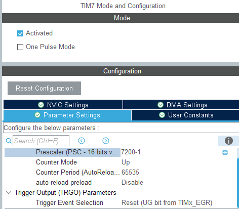
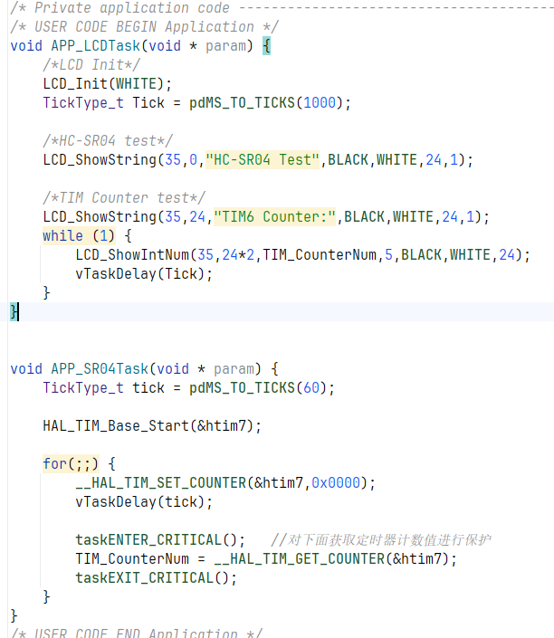
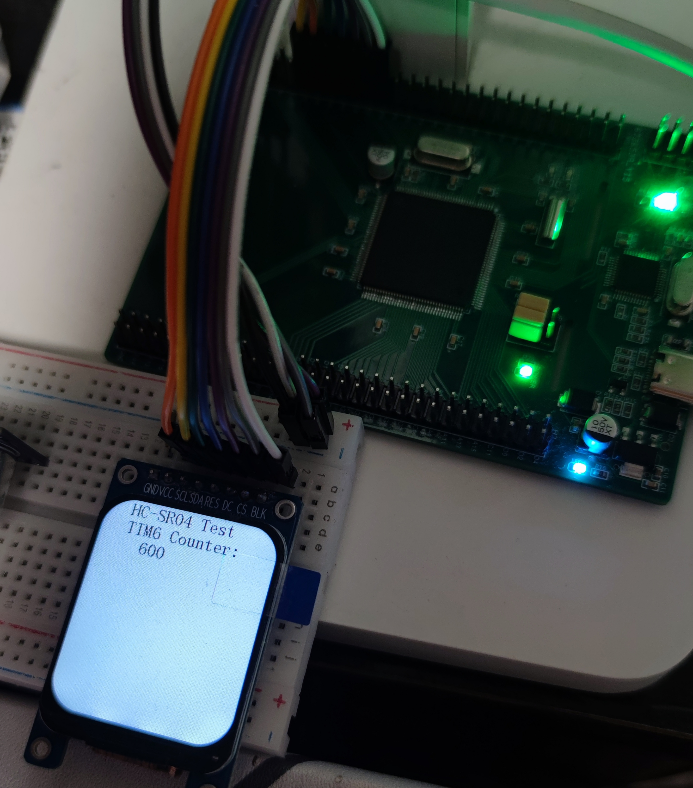
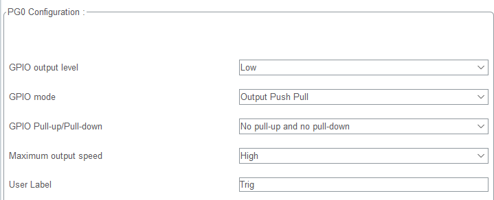
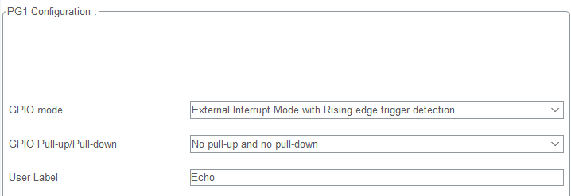
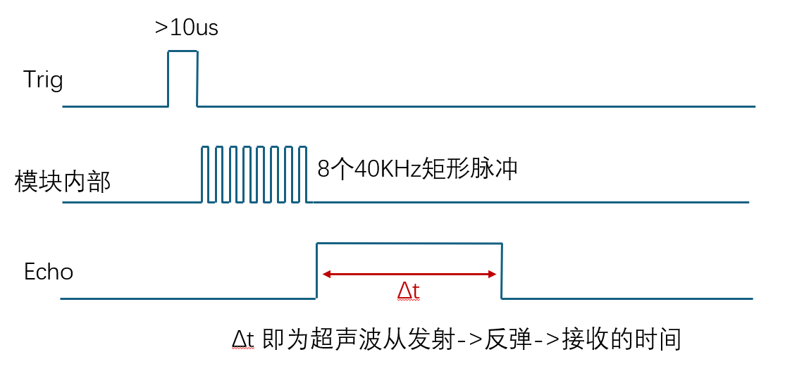

# HC-SR04超声波模块

## 基本定时器计时实验

这个实验我想探究如何利用定时器来进行计时,不使用定时器中断,所以定时器计时最长时间是∆t*65535

其中∆t是使计数器数值增1所需时间


这个实验为超声波模块做准备


### 定时器7设置如下



可得Δt = 72×10^6/(7200-1+1) = 1×10^-4s = 0.1ms

### 计时程序

```c
void APP_SR04Task(void * param) {
    TickType_t tick = pdMS_TO_TICKS(60);

    HAL_TIM_Base_Start(&htim7);

    for(;;) {
        __HAL_TIM_SET_COUNTER(&htim7,0x0000);
        vTaskDelay(tick);	//延迟60ms

        taskENTER_CRITICAL();   //对下面获取定时器计数值进行保护
        TIM_CounterNum = __HAL_TIM_GET_COUNTER(&htim7);	//按照理论TIM_CounterNum = 60/0.1 = 600
        taskEXIT_CRITICAL();
    }
}
```

启动定时器后计数器就会每隔一个Δt增1

将计数器清零后,延迟一段时间再次读取计数器的值





LCDTask会将TIM_CounterNum显示出来,显示的数字是600和理论对的上,证明我的理论没问题

# HC-SR04超声波测距实验

### HC-SR04引脚连接

| HC-SR04 | STM32F103ZET6 |
| ------- | ------------- |
| GND     | GND           |
| Trig    | PG0           |
| Echo    | PG1           |
| VCC     | 3.3V          |

### 引脚配置

**Trig**



初始化电平要为低电平

**Echo**



外部中断,初始化为上升沿触发,别忘开启全局中断


### 思路

下图是测距模块的工作时序图




我们只管Trig和Echo即可

所以一个测距循环