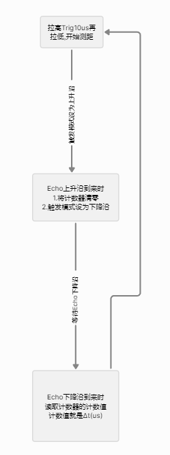
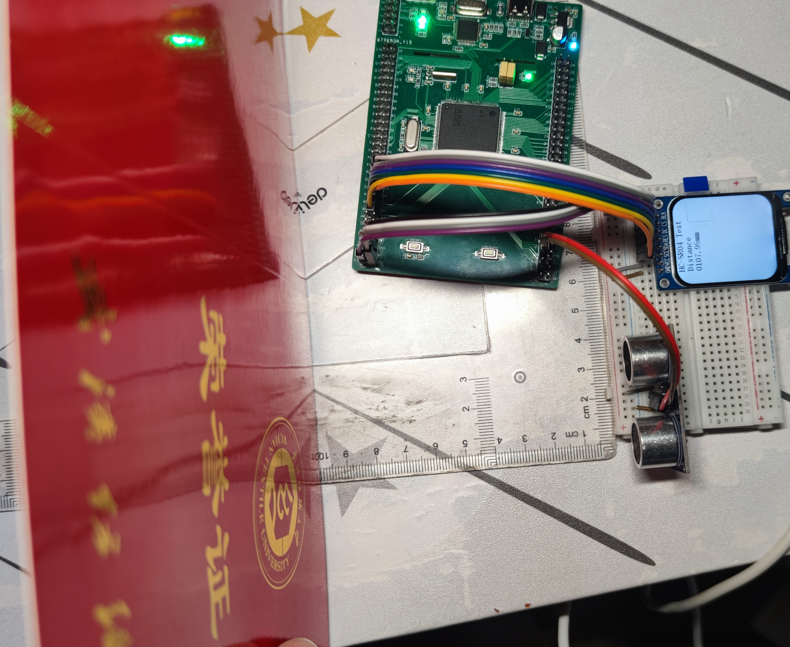

# HC-SR04超声波模块

## 基本定时器计时实验

这个实验我想探究如何利用定时器来进行计时,不使用定时器中断,所以定时器计时最长时间是∆t*65535

其中∆t是使计数器数值增1所需时间


这个实验为超声波模块做准备


### 定时器7设置如下


可得Δt = 72×10^6/(7200-1+1) = 1×10^-4s = 0.1ms

### 计时程序

```c
void APP_SR04Task(void * param) {
    TickType_t tick = pdMS_TO_TICKS(60);

    HAL_TIM_Base_Start(&htim7);

    for(;;) {
        __HAL_TIM_SET_COUNTER(&htim7,0x0000);
        vTaskDelay(tick);	//延迟60ms

        taskENTER_CRITICAL();   //对下面获取定时器计数值进行保护
        TIM_CounterNum = __HAL_TIM_GET_COUNTER(&htim7);	//按照理论TIM_CounterNum = 60/0.1 = 600
        taskEXIT_CRITICAL();
    }
}
```

启动定时器后计数器就会每隔一个Δt增1

将计数器清零后,延迟一段时间再次读取计数器的值


LCDTask会将TIM_CounterNum显示出来,显示的数字是600和理论对的上,证明我的理论没问题

# HC-SR04超声波测距实验

### HC-SR04引脚连接

| HC-SR04 | STM32F103ZET6 |
| ------- | ------------- |
| GND     | GND           |
| Trig    | PG0           |
| Echo    | PG1           |
| VCC     | 3.3V          |

### 引脚配置

**Trig**


初始化电平要为低电平

**Echo**


外部中断,初始化为上升沿触发,别忘开启全局中断


### 思路

下图是测距模块的工作时序图


我们只管Trig和Echo即可

所以一个测距循环



还有一些细节的地方,比如分辨我是上升沿进入的回调函数还是下降沿进入的回调函数,这些直接看代码

提示一下,这里用到了FreeRTOS

```c
/*Set EXT1 rising*/
void EXTI1_Rising(void) {
    GPIO_InitTypeDef GPIO_InitStruct;

    __HAL_RCC_GPIOG_CLK_ENABLE();

    GPIO_InitStruct.Pin = Echo_Pin;
    GPIO_InitStruct.Mode = GPIO_MODE_IT_RISING; //Rising
    GPIO_InitStruct.Pull = GPIO_NOPULL;
    HAL_GPIO_Init(Echo_GPIO_Port,&GPIO_InitStruct);
}

/*Set EXT1 falling*/
void EXTI1_Falling(void) {
    GPIO_InitTypeDef GPIO_InitStruct;

    __HAL_RCC_GPIOG_CLK_ENABLE();

    GPIO_InitStruct.Pin = Echo_Pin;
    GPIO_InitStruct.Mode = GPIO_MODE_IT_FALLING; //Rising
    GPIO_InitStruct.Pull = GPIO_NOPULL;
    HAL_GPIO_Init(Echo_GPIO_Port,&GPIO_InitStruct);
}

/*FreeRTOS task: HC-SR04 task*/
void APP_SR04Task(void * param) {

    TickType_t tick = pdMS_TO_TICKS(100);
    HAL_TIM_Base_Start(&htim7);


    for(;;) {
        //Give Trig 10us high level
        HAL_GPIO_WritePin(Trig_GPIO_Port,Trig_Pin,GPIO_PIN_SET);
        taskENTER_CRITICAL();
        Delay_us(20);
        taskEXIT_CRITICAL();
        HAL_GPIO_WritePin(Trig_GPIO_Port,Trig_Pin,GPIO_PIN_RESET);

        //Set Rising
        EXTI1_Rising();

        taskENTER_CRITICAL();
        EXTIState = 0;
        taskEXIT_CRITICAL();

        vTaskDelay(tick);   //delay 100ms
        taskENTER_CRITICAL();
        Distance_mm = 17.0*deltaTim/100;
        taskEXIT_CRITICAL();
    }
}


/*EXTI1 call back function*/
void HAL_GPIO_EXTI_Callback(uint16_t GPIO_Pin)
{
    if(EXTIState == 0) {    //Rising into
        __HAL_TIM_SET_COUNTER(&htim7,0x0000);
        EXTIState = 1;
        //Set exti falling
        EXTI1_Falling();
    } else if(EXTIState == 1) {
        deltaTim = __HAL_TIM_GET_COUNTER(&htim7);
    }

}
```


最后将距离通过LCD屏幕显示出来

```c
/*FreeRTOS task: LCD task*/
void APP_LCDTask(void * param) {
    /*LCD Init*/
    LCD_Init(WHITE);
    TickType_t Tick = pdMS_TO_TICKS(100);

    /*HC-SR04 test*/
    LCD_ShowString(35,0,"HC-SR04 Test",BLACK,WHITE,24,1);

    /*TIM Counter test*/
    LCD_ShowString(35,24,"Distance",BLACK,WHITE,24,1);
    LCD_ShowString(35 + 12*7,24*2,"mm",BLACK,WHITE,24,1);

    while (1) {
        LCD_ShowFloatNum1(35,24*2,Distance_mm,6,BLACK,WHITE,24);
        vTaskDelay(Tick);
    }
}
```

### 效果

大概7mm的小误差,能接受

